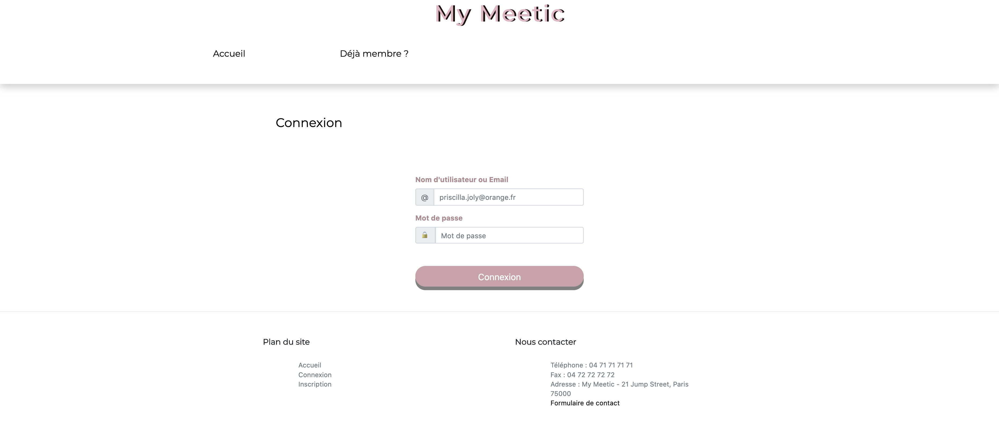
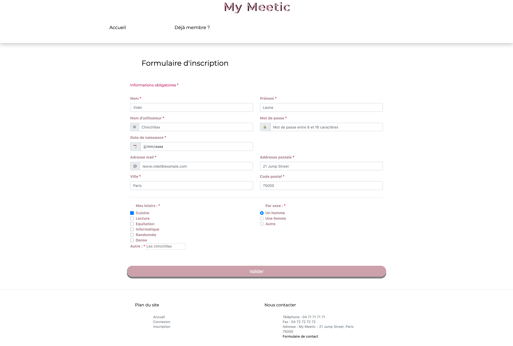
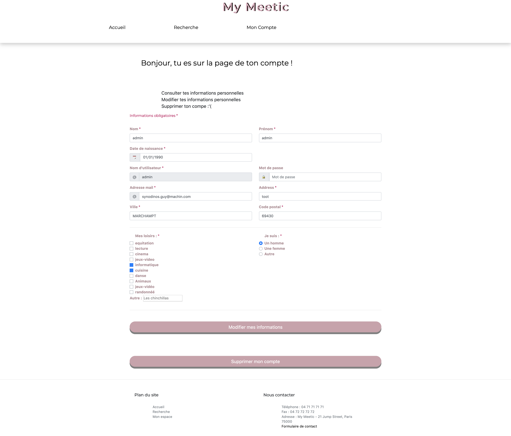
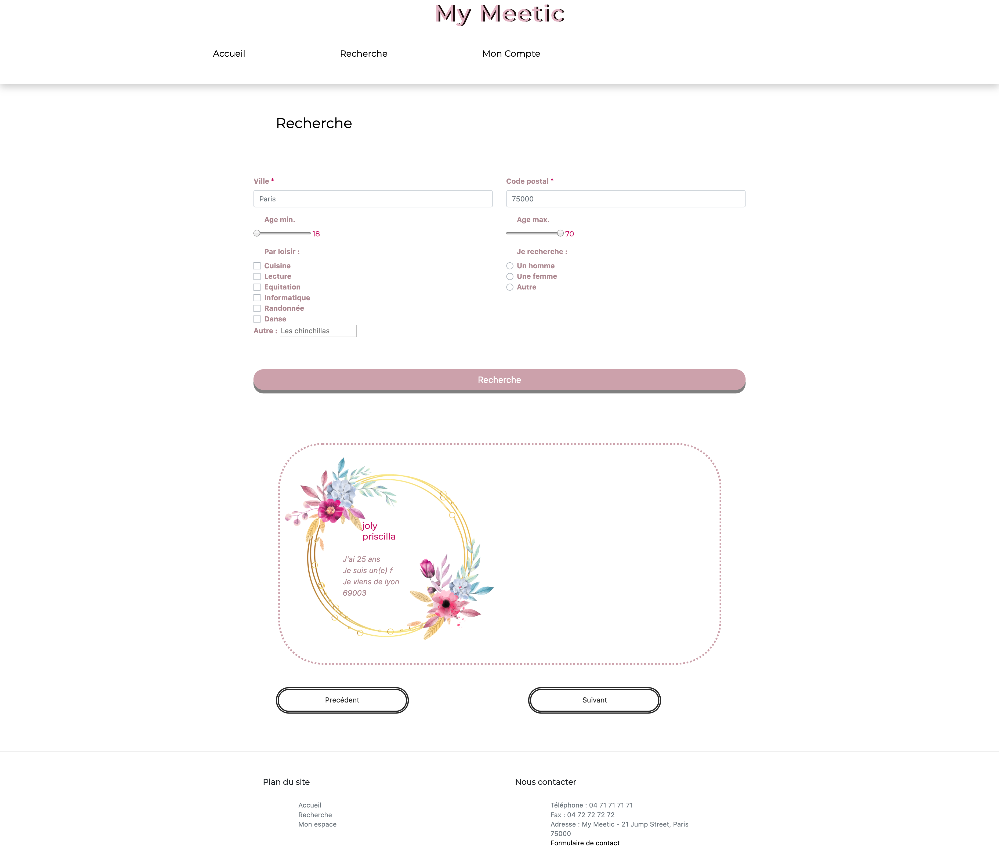

# My_meetic 

### PHP version 

```bash
    7.1 minimum
```

### Install composer on Mac 

```bash
    brew install composer
```

### Install composer on Linux

```bash
    php composer-setup.php --install-dir=bin --filename=composer
    mv composer /usr/local/bin/composer
```

## Install the project

```bash
    composer install
```

## Import the database 

```bash
    cf sql -> requette_sql.sql
```

### Launch the server 

```bash
    php -S localhost:8080 -t public
```

### Quitte le serveur

```bash
    CTRL C
```

# For the database 

## Connexion on your database

````bash
    Change the username and password in src > Tools > Database.php 
    and DSN if you don't use MySql or MariaDB
````

## Table utilisateur

````bash
    if ('sexe' === 'f') -> The user is a woman
    if ('sexe' === 'h') -> The user is a man
    if ('sexe' === 'o') -> Other sex
````
### Know if the user delete his account

```bash
    if ('actif' === 0) -> The user delete his account
    if ('actif' === 1) -> The user don't  delete his account
```
### Know if the user's hobbie is active

```bash
    if ('actif' === 0) -> This hobbie isn't active
    if ('actif' === 1) -> This hobbie is active
```

# Website preview





